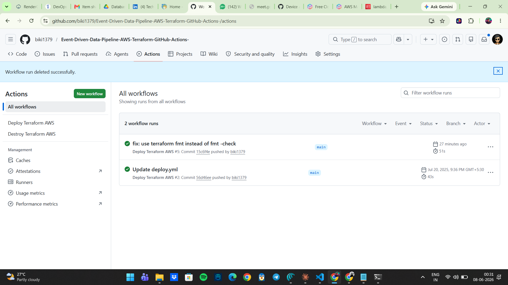
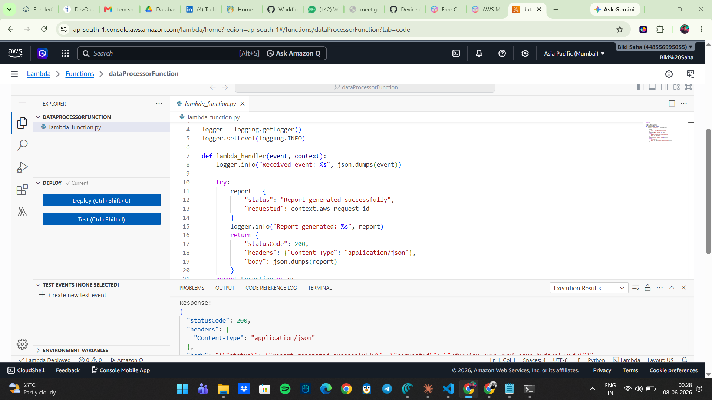
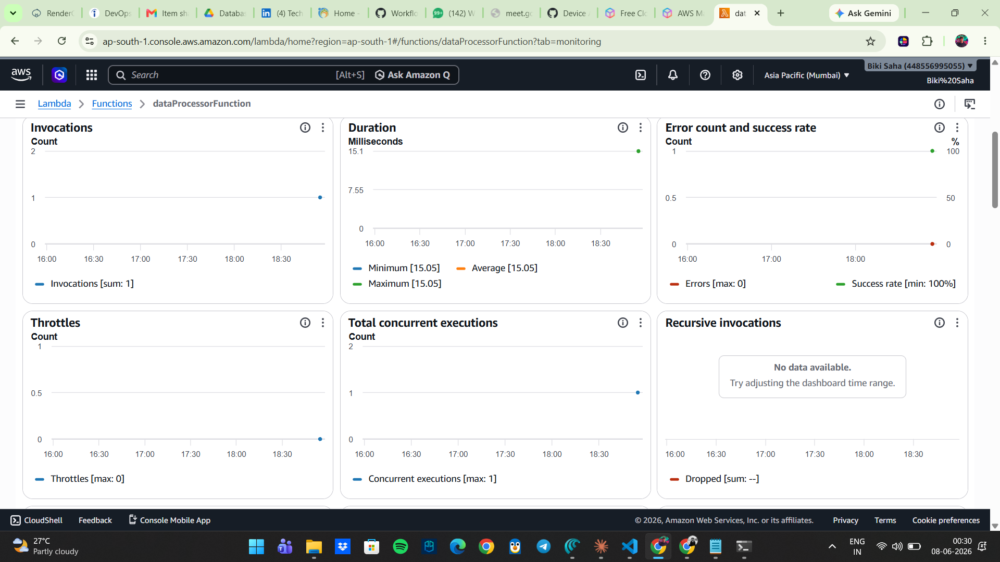
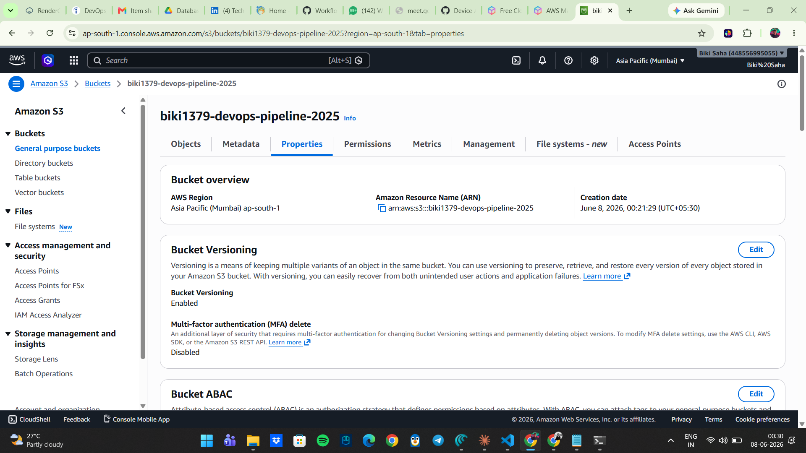
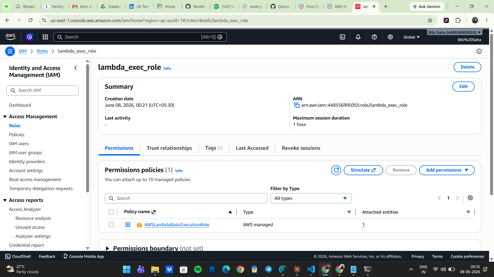

# AWS Serverless Data Processor — IaC with Terraform & GitHub Actions

> Automated provisioning of an AWS Lambda + S3 pipeline using Terraform, deployed via a GitHub Actions CI/CD workflow.

---

## Architecture

```
GitHub Push (main)
       │
       ▼
GitHub Actions CI/CD
       │
       ├── Package Lambda (.zip)
       ├── terraform fmt / validate
       ├── terraform plan
       └── terraform apply
              │
              ├── S3 Bucket (versioned, encrypted, public-access blocked)
              ├── IAM Role + AWSLambdaBasicExecutionRole policy
              └── Lambda Function (Python 3.13, logs to CloudWatch)
```

---

## Tech Stack

| Layer | Tool |
|---|---|
| Cloud | AWS (Lambda, S3, IAM, CloudWatch) |
| Infrastructure as Code | Terraform >= 1.5 |
| CI/CD | GitHub Actions |
| Runtime | Python 3.13 |

---

## Project Structure

```
.
├── .github/
│   └── workflows/
│       ├── deploy.yml       # Triggered on push to main
│       └── destroy.yml      # Manual trigger via workflow_dispatch
├── lambda/
│   └── lambda_function.py   # Lambda handler with structured logging
└── terraform/
    ├── main.tf              # S3, IAM, Lambda resources
    ├── provider.tf          # AWS provider + version constraints
    ├── variables.tf         # Input variable definitions
    ├── outputs.tf           # Exported resource values
    └── terraform.tfvars.example
```

---

## Getting Started

### Prerequisites

- AWS account with programmatic access
- Terraform >= 1.5 installed locally (for local runs)
- GitHub repository with Actions enabled

### 1. Clone the repository

```bash
git clone https://github.com/your-username/your-repo.git
cd your-repo
```

### 2. Configure GitHub Secrets

Go to **Settings → Secrets and variables → Actions** and add:

| Secret | Description |
|---|---|
| `AWS_ACCESS_KEY_ID` | IAM user access key |
| `AWS_SECRET_ACCESS_KEY` | IAM user secret key |
| `S3_BUCKET_NAME` | Desired S3 bucket name (globally unique) |

### 3. Deploy

Push to the `main` branch — GitHub Actions will automatically:

1. Package the Lambda function into a `.zip`
2. Run `terraform fmt`, `validate`, and `plan`
3. Apply the infrastructure on successful plan

```bash
git push origin main
```

### 4. Destroy (when done)

Trigger the **Destroy Terraform AWS** workflow manually from the **Actions** tab.

---

## Local Development

```bash
# Package Lambda
cd lambda && zip lambda_function.zip lambda_function.py

# Configure Terraform variables
cp terraform/terraform.tfvars.example terraform/terraform.tfvars
# Edit terraform.tfvars with your values

# Init, plan, apply
cd terraform
terraform init
terraform plan
terraform apply
```

---

## Security Practices

- **No secrets in code** — all credentials passed via GitHub Secrets
- **State files excluded** from version control via `.gitignore`
- **S3 bucket** has versioning enabled, AES-256 encryption, and all public access blocked
- **IAM Role** uses least-privilege: only `AWSLambdaBasicExecutionRole` is attached
- **Terraform Apply** only runs on direct push to `main` — PRs only trigger `plan`

---

## CI/CD Pipeline

```
PR to main     →  fmt check + validate + plan  (no apply)
Push to main   →  fmt check + validate + plan + apply
Manual trigger →  destroy
```

---

## Screenshots

### CI/CD Pipeline — All Steps Green


### AWS Lambda — Successful Test Invocation


### AWS Lambda — CloudWatch Monitoring


### S3 Bucket — Versioning Enabled


### IAM Role — Least Privilege Policy


## Lambda Function

The function accepts any event payload, logs the request via Python's `logging` module (visible in CloudWatch), and returns a structured JSON response including the AWS request ID for traceability.

---

## License

MIT
